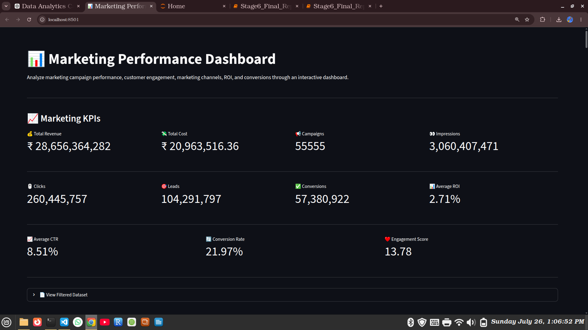
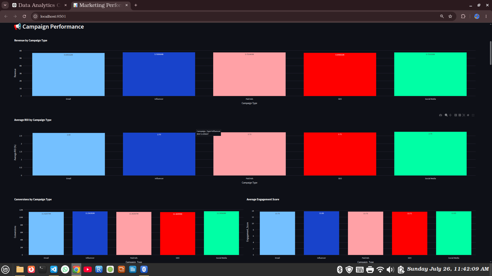
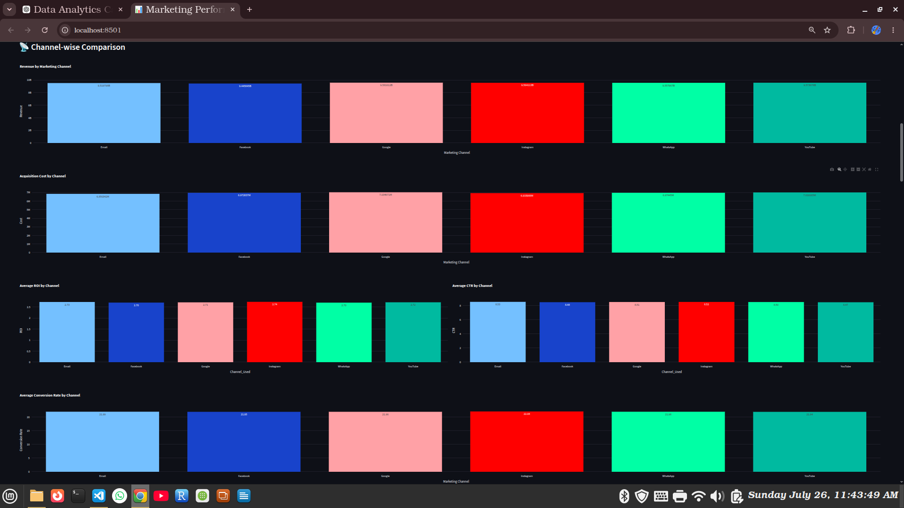
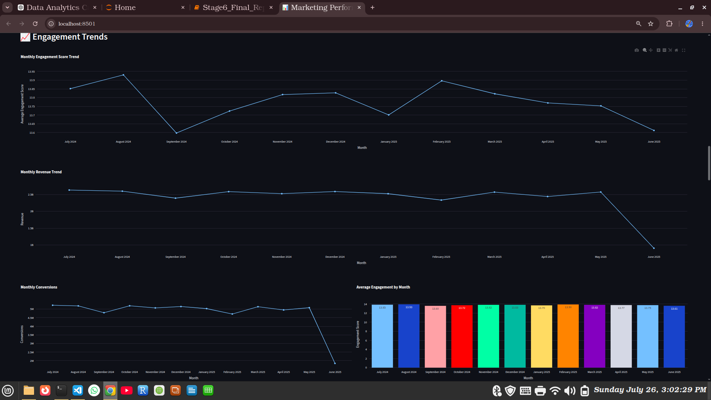
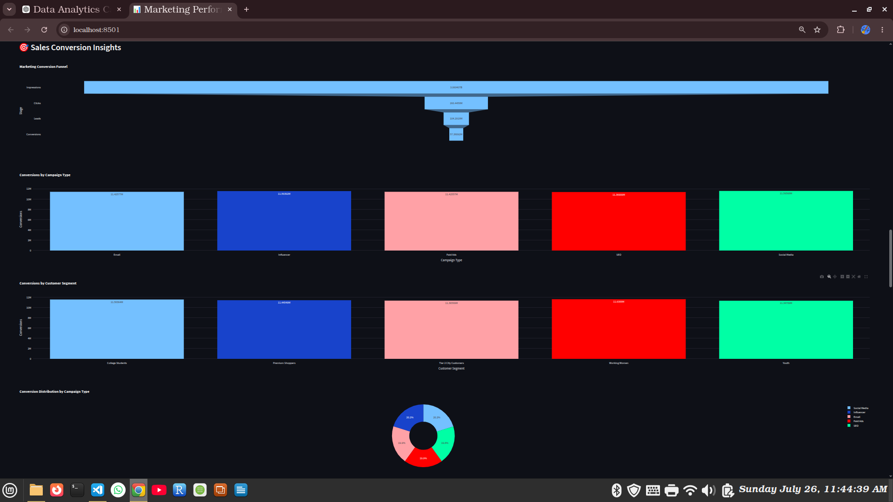
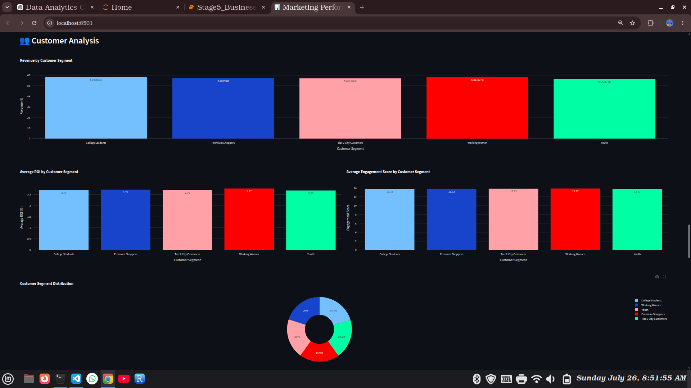
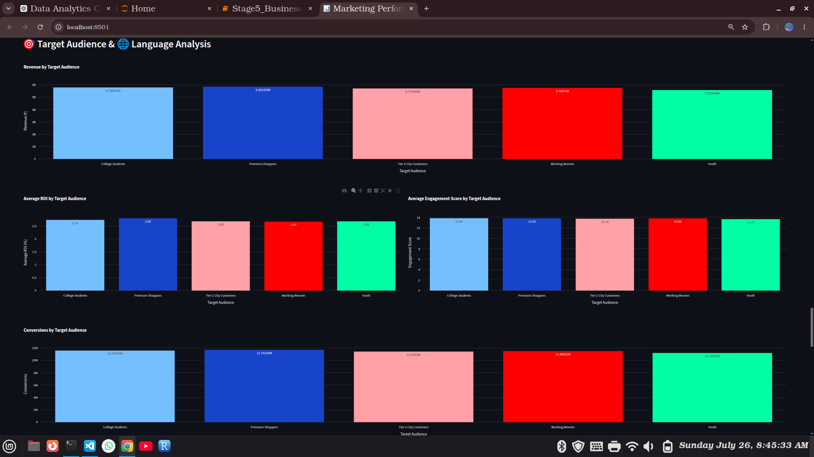
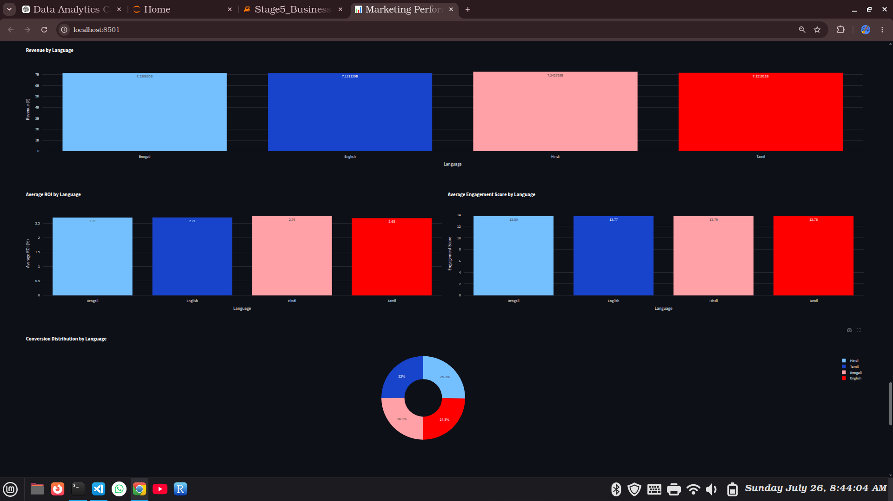

# 📊 Marketing Performance Dashboard

A comprehensive Data Analytics Capstone Project that analyzes marketing campaign performance using Python, Streamlit, Pandas, and Plotly.

The dashboard provides interactive visualizations and business insights to help evaluate marketing campaigns, customer engagement, return on investment (ROI), conversion rates, and channel performance.

---

# 🎯 Project Overview

Marketing campaigns generate large amounts of data across multiple channels. This project transforms raw marketing campaign data into an interactive dashboard that enables users to monitor campaign performance and make data-driven decisions.

The dashboard includes key performance indicators (KPIs), campaign analysis, channel-wise comparison, customer segmentation, engagement trends, sales conversion insights, and target audience analysis.

---

# ✨ Features

- Interactive Streamlit Dashboard
- Sidebar Filters
  - Campaign Type
  - Marketing Channel
  - Customer Segment
  - Language
- Marketing KPI Dashboard
  - Total Revenue
  - Acquisition Cost
  - Total Campaigns
  - Impressions
  - Clicks
  - Leads
  - Conversions
  - Average ROI
  - Average CTR
  - Conversion Rate
  - Engagement Score
- Campaign Performance Analysis
- Channel-wise Comparison
- Monthly Engagement Trends
- Revenue Trends
- Sales Conversion Funnel
- Customer Segment Analysis
- Target Audience Analysis
- Language-wise Performance Analysis
- Download Filtered Dataset as CSV
- Interactive Plotly Visualizations
- Business Insights and Final Report

---

# 🛠️ Tools & Technologies Used

- Python
- Streamlit
- Pandas
- Plotly Express
- Jupyter Notebook
- VS Code
- Git
- GitHub

---

# 📂 Dataset

**Dataset Name:**
Nykaa Marketing Campaign Dataset

The dataset contains marketing campaign information including:

- Campaign ID
- Campaign Type
- Target Audience
- Marketing Channel
- Impressions
- Clicks
- Leads
- Conversions
- Revenue
- Acquisition Cost
- ROI
- Engagement Score
- Customer Segment
- Language
- Date

Additional features created during preprocessing:

- CTR
- Conversion Rate
- Year
- Month
- Month Number
- Quarter

---

# 📁 Project Structure

```
Marketing-Performance-Dashboard/
│
├── Stage1_Stage3_Marketing_Data_Analysis.ipynb
├── Stage5_Business_Insights.ipynb
├── Stage6_Final_Report.ipynb
├── app.py
├── cleaned_marketing_data.csv
├── requirements.txt
├── README.md
├── assets/
│   ├── Dashboard_Overview.png
│   ├── Campaign_Performance.png
│   ├── Channel_Comparison.png
│   ├── Engagement_Trends.png
│   ├── Sales_Conversion_Insights.png
│   ├── Customer_Analysis.png
│   ├── Target_Audience_Analysis.png
│   └── Language_Analysis.png
└── original_dataset.csv
```

---

# ⚙️ Installation

## Clone the Repository

```bash
git clone <repository-link>
```

Move to the project folder.

```bash
cd Marketing-Performance-Dashboard
```

Install the required packages.

```bash
pip install -r requirements.txt
```

---

# ▶️ How to Run the Streamlit App

Run the following command:

```bash
streamlit run app.py
```

The dashboard will open automatically in your default web browser.

---

# 📸 Dashboard Screenshots

## Dashboard Overview



---

## Campaign Performance



---

## Channel-wise Comparison



---

## Engagement Trends



---

## Sales Conversion Insights



---

## Customer Analysis



---

## Target Audience Analysis



---

## Language Analysis



---

# 📈 Key Dashboard Insights

- Analyze campaign-wise revenue and ROI.
- Compare marketing channel performance.
- Track monthly engagement and revenue trends.
- Monitor customer segment performance.
- Evaluate sales conversion funnel.
- Compare language-wise campaign effectiveness.
- Filter data dynamically using interactive dashboard controls.

---

# 📚 Business Insights

The dashboard helps identify:

- Best-performing marketing campaigns
- Most effective marketing channels
- High-value customer segments
- Customer engagement trends
- Conversion performance
- Revenue-generating target audiences
- Language-wise marketing effectiveness

---

# 🚀 Future Enhancements

- Deploy the dashboard on Streamlit Community Cloud.
- Add predictive analytics using Machine Learning.
- Integrate real-time marketing campaign data.
- Add user authentication.
- Enable automated report generation.

---

# 👨‍💻 Developed By

**Samarpan Pandit**

**Data Analytics Capstone Project**

Year: **2026**

---

# 📄 License

This project is developed for educational and academic purposes.
